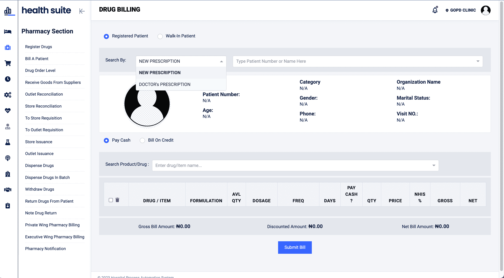
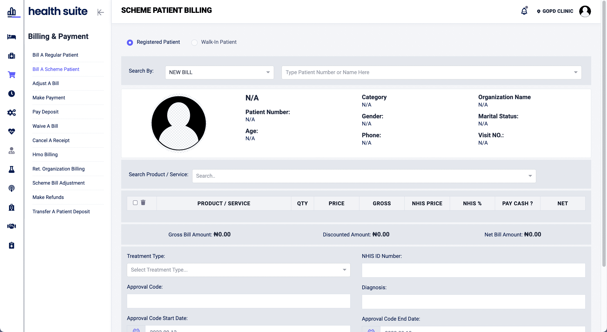
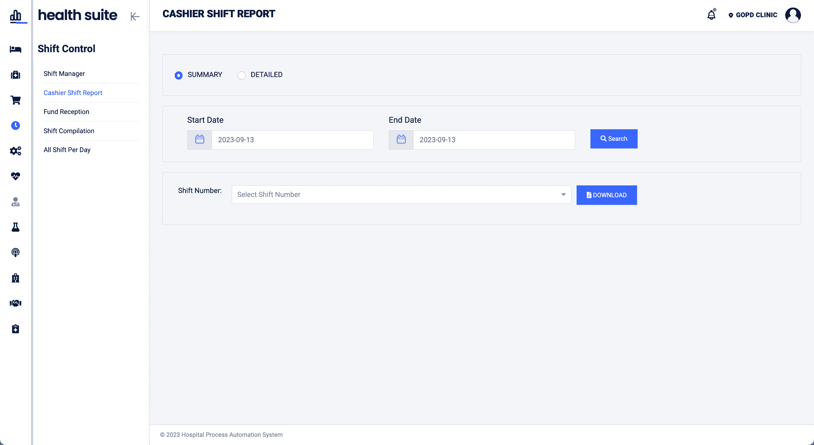

# HealthSuite 

## Description

HealthSuite is a robust Hospital Management Information System. It aims to help hospitals of any size manage their entire process in one place.

## Screen shot

See a live demo on my website [healthsuite demo](https://healthsuite.jamesaworo.com)
Learn more [here](https://jamesaworo.com/projects/)

A few screenshot from Healthsuite in action.

- Patient Registration
    

        
    

- Patient Registration (Dark Mode)
    

        
    

- Upload Drug & Services 
    

        
    

- Patient Drug Billing
    

        
    

- Scheme Patient Billing
    

        
    

- Cashier Shift Report
    

        
    

- Patient Bill Payment (Dark Mode)
    

        
    

## Features

HealthSuite has different modules that cover various aspects of hospital management, such as:

- **EMR** (Electronic Medical Records): 
   Allows storing and retrieving patient records, medical history, prescriptions, diagnoses, etc.

- **Pharmacy Module**: Enables managing inventory, dispensing drugs, generating invoices, etc.

- **Billing and Payment Module**: Handles billing and payment processes, such as insurance claims, discounts, receipts, etc.

- **Shift and Cashier Control**: Tracks and controls the shifts and cashiers of the hospital staff, such as nurses, doctors, pharmacists, etc.

- **Settings and Configuration Module**: Allows customizing and configuring the system settings, such as hospital name, logo, address, etc.

- **Nurse Module**: Provides features for nurses to manage their tasks, such as triaging patients, recording vital signs, administering medications, etc.

- **Doctor’s Clerking Module**: Provides features for doctors to manage their tasks, such as examining patients, ordering tests, writing notes, etc.

- **Laboratory Module**: Provides features for laboratory technicians to manage their tasks, such as performing tests, recording results, generating reports, etc.

- **Radiology Module**: Provides features for radiology technicians to manage their tasks, such as performing scans, recording images, generating reports, etc.

- **Reports Module**: Provides features for generating and viewing various reports, such as patient statistics, revenue analysis, performance evaluation, etc.

- ** Users, Role and Permission Module **: For managing roles and access rights, users with certain permission can perform only allowed operations. (Role and Permission Base Authorization)

- **and many more**..

Certainly! You can use badges to list the tools used in your project in a section called "Tools" like this:

## Tools

Here are the tools and technologies used in the development of HealthSuite:

 
 
 
 

## Installation
   
To install HealthSuite on your local machine, follow these steps:
   
   - Clone this repository to your desired location using 
     - `git clone https://github.com/jamesawo/healthsuite.git`

   - cd into `healthsuite` directory

   - Install the required dependencies using 
     - `mvn clean install`

   - Create a PostgreSQL database named healthsuite

   - Update the application.properties file  with your database credentials and other settings. 

   - Open your browser and navigate to http://localhost:8080 to access the application.

## Usage

To use HealthSuite, you need to create an account and log in with your credentials. 
You can choose from different roles depending on your function in the hospital. 
Each role has different access levels and features available.

For example, 

- if you log in as a doctor, you can see the list of patients assigned to you, view their details and medical records, order tests and scans, write prescriptions and notes, etc.

- If you log in as a pharmacist, you can see the list of prescriptions waiting to be dispensed, manage your inventory and invoices, etc.

- If you log in as an administrator, you can see the dashboard with various reports and statistics, manage the system settings and configuration, add or remove users and roles, etc.

## License

HealthSuite is licensed under the MIT License. See the LICENSE file for more details.

## Contributing

HealthSuite is an open-source project and welcomes contributions from anyone. If you want to contribute to this project, please follow these steps:

- Fork this repository and create a new branch with a descriptive name.
- Make your changes and commit them with a clear message.
- Push your changes to your forked repository and create a pull request.
- Wait for your pull request to be reviewed and merged.

## Author 
-   James Aworo 

## Contact
If you have any questions or feedback about HealthSuite, please feel free to contact me at [james.aworo@outlook.com](mailto:james.aworo@outlook.com).